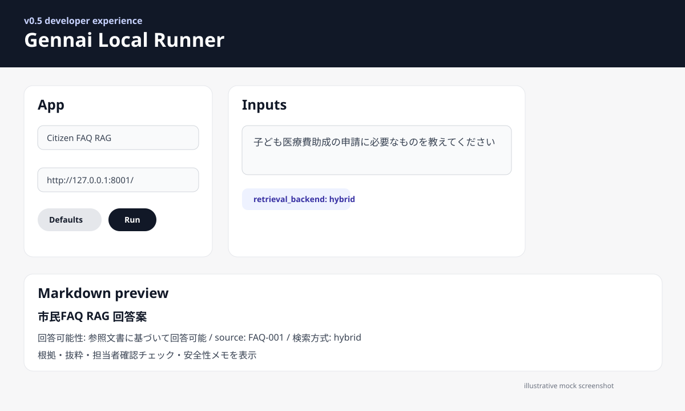
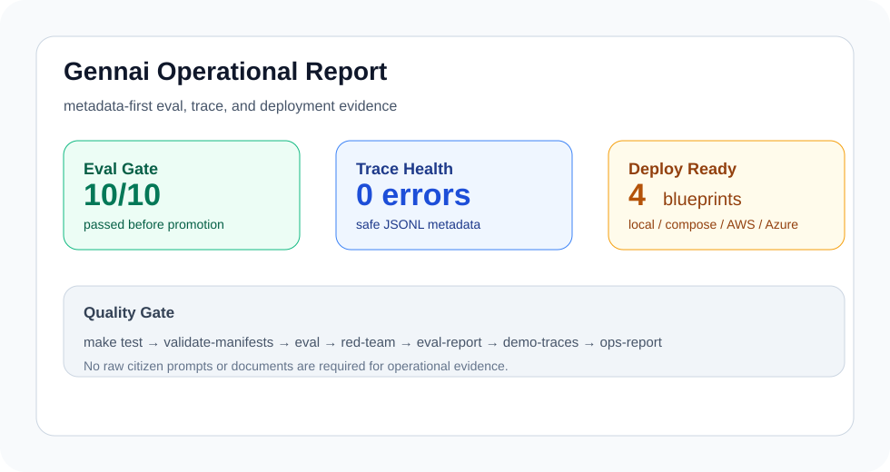
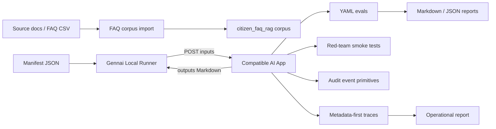

# gennai-civic-lab

[](https://github.com/masaakisakamoto/gennai-civic-lab/actions/workflows/ci.yml)

**源内互換の自治体・行政AIアプリを、誰でも作れる・試せる・評価できる非公式OSSラボ**です。

> This project is an unofficial community project. It is not affiliated with, endorsed by, or maintained by the Digital Agency of Japan.





## What this repository demonstrates

`gennai-civic-lab` is not a prompt demo. It is a small but coherent engineering system for public-sector AI apps:

- **Gennai-compatible app contract**: request `inputs`, response `{ "outputs": "Markdown text" }`
- **Civic AI apps**: easy Japanese rewriting and grounded citizen FAQ RAG
- **Developer experience**: local browser runner, manifest-driven forms, curl export
- **Quality gates**: unit tests, manifest validation, YAML evals, red-team smoke tests
- **Safety posture**: PII redaction helpers, prompt-injection detection, abstention on weak evidence
- **Operational artifacts**: Markdown/JSON eval reports, metadata-first traces, metrics summaries, and PII-conscious audit event primitives
- **Data onboarding**: CSV/JSONL FAQ corpus import for `citizen_faq_rag`
- **Deployment readiness**: local, Docker Compose, AWS, and Azure blueprints

## Architecture



## Repository map

```text
apps/
  easy_japanese_rewriter/      # v0.2 flagship app
  citizen_faq_rag/             # v0.3 grounded FAQ RAG app
  meeting_summary/
  sports_promotion_advisor/
  policy_briefing/
  ordinance_checklist/

packages/
  gennai_app_kit/              # SDK: request/response, guardrails, LLM adapter, audit primitives
  gennai_evals/                # YAML eval runner + report writer
  gennai_cli/                  # app scaffold CLI
  gennai_local_runner/         # v0.5 local browser UI, Markdown preview, curl export
  gennai_form_spec/            # manifest JSON Schema
  gennai_red_team_lite/        # prompt-injection / PII / hallucination smoke tests
  gennai_observability/        # v0.6 traces, metrics summaries, operational reports

scripts/
  validate_manifests.py
  import_faq_corpus.py
  generate_demo_traces.py
  generate_ops_report.py

manifests/                     # 源内Webに登録するリクエスト形式JSON例
evals/                         # 評価ケース
docs/                          # 設計・セキュリティ・OSS戦略
blueprints/                    # local / Docker Compose / AWS / Azure deployment notes
tests/                         # unit tests
```

## 1-minute quickstart

```bash
python3 -m venv .venv
source .venv/bin/activate
make install
make test
make validate-manifests
make eval
make red-team
make eval-report
make ops-report
```

Expected quality gates:

```text
pytest: all tests pass
manifest validation: 6 manifests OK
eval: easy_japanese + citizen_faq pass
red-team: PII / injection / abstention smoke tests pass
ops-report: eval + trace operational report generated
```

## Run the local browser runner

Terminal A:

```bash
make run-faq-rag
```

Terminal B:

```bash
make run-local-runner
```

Open:

```text
http://127.0.0.1:8010/
```

Try:

```text
子ども医療費助成の申請に必要なものを教えてください
```

The Local Runner reads `manifests/*.gennai.json`, renders an input form, calls the local endpoint, shows a **Markdown preview**, shows the **raw outputs**, previews the exact JSON payload, and exports a reproducible **curl command**.

## Run the Citizen FAQ RAG app directly

```bash
curl -X POST http://127.0.0.1:8001/ \
  -H 'Content-Type: application/json' \
  -d '{
    "inputs": {
      "question": "子ども医療費助成の申請に必要なものを教えてください",
      "use_sample_corpus": "yes",
      "answer_style": "市民向け",
      "mode": "safe",
      "retrieval_backend": "hybrid",
      "max_results": 3
    }
  }'
```

It returns:

- answer draft
- evidence
- source IDs
- excerpts
- matched terms
- answerability judgment
- staff review checklist
- safety notes

When evidence is weak, it abstains instead of inventing an answer.

## Generate eval reports

```bash
make eval-report
```

Outputs:

```text
reports/eval-report.md
reports/eval-report.json
```

These files are intentionally ignored by Git so each run can create fresh local artifacts.

## Generate operational reports

v0.6 adds metadata-first traces and an operational report. This gives reviewers a small evidence bundle without storing raw citizen text.

```bash
make ops-report
```

Outputs:

```text
reports/traces.jsonl
reports/ops-report.md
reports/ops-report.json
```

The demo trace generator records app id, request duration, status, backend, and hit counts. It does **not** record raw prompts or raw documents. See [`docs/operations.md`](docs/operations.md).

## Deployment blueprints

v0.6 includes practical deployment notes:

```text
blueprints/local/
blueprints/docker-compose/
blueprints/aws/
blueprints/azure/
```

These are intentionally conservative. Local Runner should remain internal-only, and production systems should use private networking, authentication, least-privilege credentials, and metadata-only logging.

## Import FAQ data

Create or edit `examples/faq_sample.csv`, then run:

```bash
make import-faq-demo
```

Or run directly:

```bash
python scripts/import_faq_corpus.py \
  --input examples/faq_sample.csv \
  --output apps/citizen_faq_rag/corpus/imported_faq.md \
  --title "Imported Demo FAQ"
```

See [`docs/faq-corpus-import.md`](docs/faq-corpus-import.md).

## Create a new compatible app

```bash
python packages/gennai_cli/src/gennai_cli/create_app.py document-risk-checker
```

This creates:

```text
apps/document_risk_checker/
manifests/document_risk_checker.gennai.json
evals/document_risk_checker.yaml
tests/test_document_risk_checker.py
```

## Optional LLM mode

The apps work offline with deterministic fallback rules. To use an OpenAI-compatible chat completion endpoint, set:

```bash
export GENNAI_LLM_PROVIDER=openai_compatible
export GENNAI_LLM_BASE_URL=https://api.example.com/v1
export GENNAI_LLM_API_KEY=...
export GENNAI_LLM_MODEL=your-model
```

No API key is required for tests or local demos.

## Quality bar

This project treats public-sector AI apps as production software, not prompt demos.

```text
Typed request parsing
Deterministic fallback
LLM abstraction
Structured Markdown output
Tests and evals
Eval reports
Security notes
PII handling
Prompt-injection checks
Evidence-first RAG
Abstention on weak evidence
Manifest schema validation
Local browser runner
Curl export
Audit event primitives
Metadata-first traces
Operational reports
Deployment blueprints
Clear unofficial status
```

## Release highlights

| Version | Focus |
|---|---|
| v0.2 | `easy_japanese_rewriter` flagship app |
| v0.3 | `citizen_faq_rag` grounded RAG app |
| v0.4 | Local runner, CLI scaffold, RAG backends, red-team smoke tests |
| v0.5 | Markdown preview, curl export, eval reports, FAQ import, audit primitives, README polish |
| v0.6 | Observability package, operational reports, demo traces, deployment blueprints |

## License

MIT License. See `LICENSE`.

## Caution

When handling administrative documents, personal information, confidential information, or legally sensitive text, follow your organization’s rules, applicable laws, security policies, and AI usage guidelines. This OSS is a development aid, not a legal or policy decision maker.
