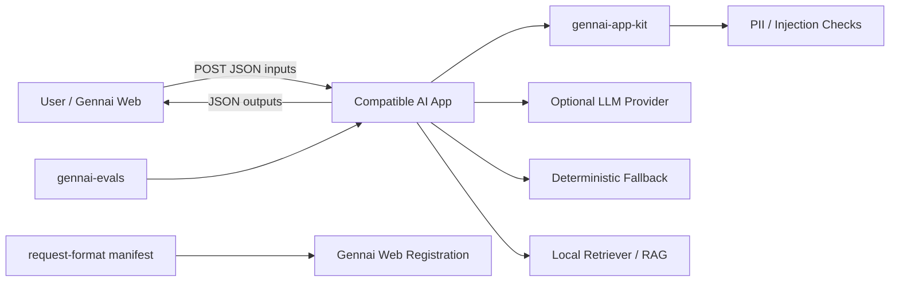

# Architecture



## Compatibility target

The compatible app receives:

```json
{
  "inputs": {
    "text": "..."
  }
}
```

And returns:

```json
{
  "outputs": "Markdown text"
}
```

## Package boundaries

| Layer | Responsibility |
|---|---|
| `apps/*` | Domain-specific AI apps |
| `gennai_app_kit` | Request parsing, response rendering, safety helpers, LLM adapter |
| `gennai_evals` | Regression/eval runner |
| `gennai_form_spec` | Manifest schema |
| `docs/*` | Engineering narrative and implementation guidance |

## Design principles

1. Keep the wire contract tiny.
2. Push repeated logic into SDK.
3. Make demos work without cloud credentials.
4. Make safety visible in every output.
5. Prefer small composable apps over one mega-app.


## v0.3 RAG architecture

`citizen_faq_rag` intentionally starts with a dependency-free lexical retriever instead of cloud embeddings.
This keeps the demo reproducible and makes the behavior easy to inspect in public-sector reviews.

```text
question
  -> normalize inputs
  -> optional PII redaction
  -> parse Markdown FAQ corpus into source documents
  -> deterministic lexical retrieval
  -> evidence threshold / abstention check
  -> Markdown answer with source IDs, excerpts, safety notes, and review checklist
```

Production deployments can swap the retriever for BM25, vector search, hybrid search, or a managed search service while keeping the app-level contract unchanged.


## v0.4 local developer loop

```text
manifests/*.gennai.json
  -> gennai-local-runner
  -> localhost app endpoint
  -> { "outputs": "Markdown" }
  -> browser result panel
```

`gennai-local-runner` intentionally stays outside the app runtime. It is a developer aid for testing the same request/response shape expected by Gennai-compatible external apps.

Citizen FAQ RAG now uses a backend interface:

```text
question + documents
  -> SearchBackend
    -> lexical | bm25 | hybrid
  -> SearchHit[]
  -> grounded answer formatter
```
